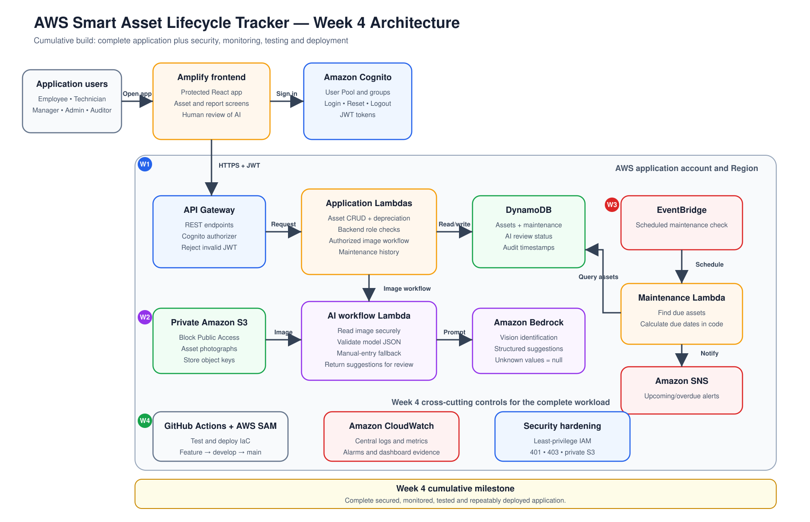
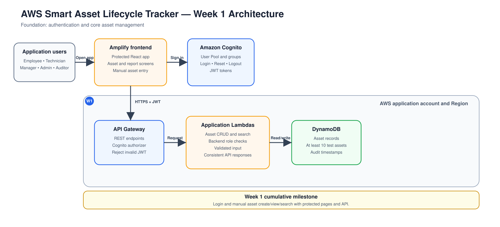
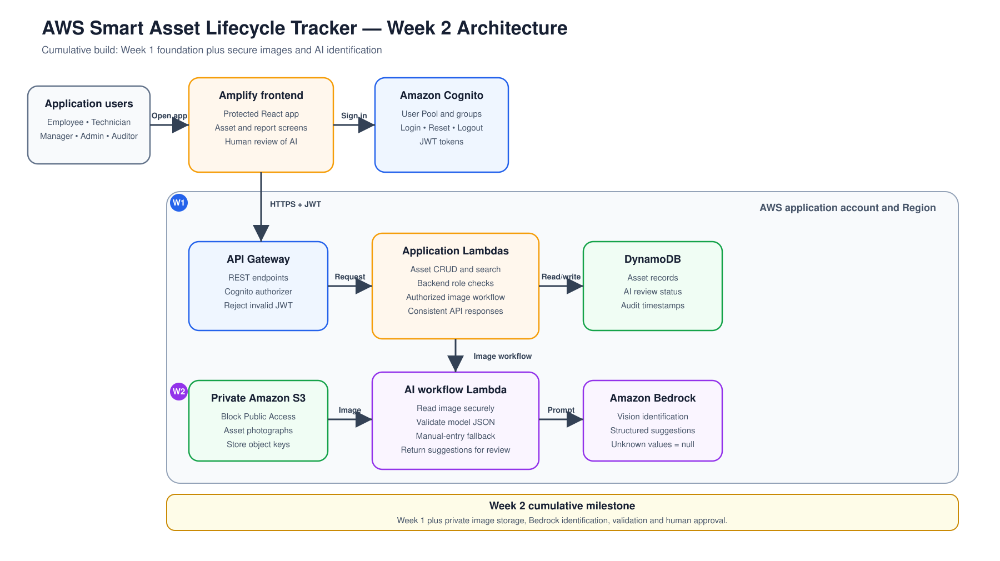
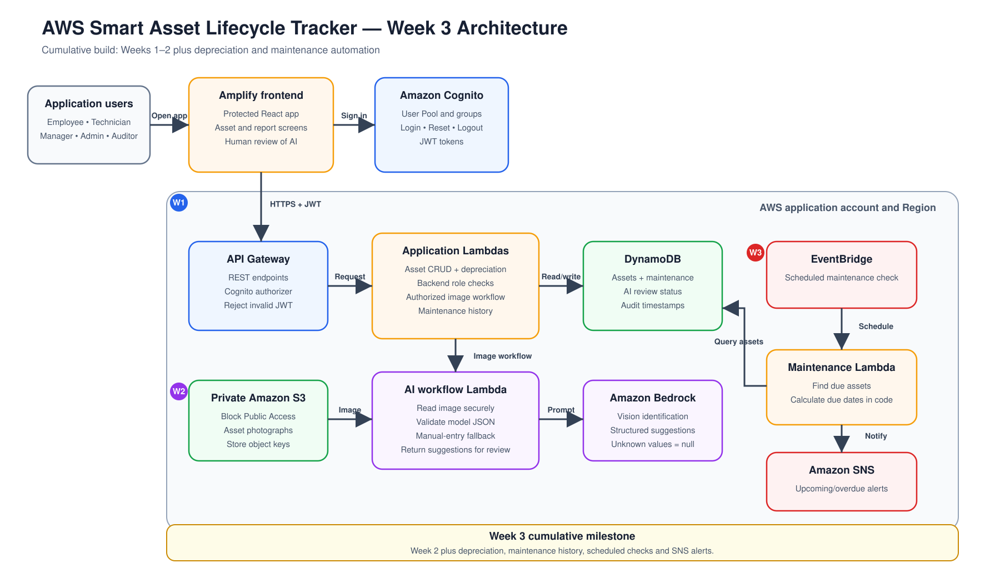

# AWS Smart Asset Lifecycle Tracker

A secure, serverless asset-tracking application developed as part of the Digital Cloud Training project course.

## Project Goal

The application will help an organization register, locate, assign and maintain technology assets. It will calculate asset depreciation and use Amazon Bedrock to provide AI-assisted asset identification and maintenance recommendations.

## Week 1 Milestone

An authenticated user can:

* Log in and log out
* Reset their password
* Access protected application pages
* Manually create an asset
* View asset records
* Search for assets

An unauthenticated user cannot access the application or its protected API.

## Planned AWS Services

* AWS Amplify
* Amazon Cognito
* Amazon API Gateway
* AWS Lambda
* Amazon DynamoDB
* Amazon S3
* Amazon Bedrock
* Amazon EventBridge
* Amazon SNS
* Amazon CloudWatch
* AWS SAM

## Project Status

Week 1 — Authentication and core asset management.

## Architecture

The architecture is developed cumulatively across the four project weeks. Each week builds on the services and functionality completed during the previous week.

### Complete Target Architecture

The complete target architecture represents the final serverless application after all four project weeks.

### Weekly Architecture Progression

#### Week 1 — Authentication and Core Asset Management

Week 1 establishes the application foundation with an Amplify frontend, Cognito authentication, protected API Gateway endpoints, Lambda application logic and DynamoDB asset storage.

#### Week 2 — Secure Image Upload and AI Identification

Week 2 extends the Week 1 architecture with private S3 image storage, an AI-processing Lambda function, Amazon Bedrock and human review of AI-generated suggestions.

#### Week 3 — Depreciation and Maintenance Automation

Week 3 extends the previous architecture with depreciation calculations, maintenance history, scheduled EventBridge checks, a maintenance Lambda function and SNS notifications.

#### Week 4 — Security, Monitoring and Final Deployment

Week 4 completes the target architecture shown at the beginning of this section. A second Week 4 diagram is not displayed because the Week 4 architecture is the complete target architecture.

During Week 4, the team will:

* Complete backend role-based authorization
* Apply least-privilege IAM permissions
* Secure access to private S3 images
* Configure CloudWatch logs and alarms
* Test unauthorized and unsuccessful requests
* Complete the AWS SAM deployment
* Review the application for exposed credentials
* Prepare the project documentation and final demonstration

## Security

AWS credentials, passwords, access tokens and personal information must never be committed to this repository.
