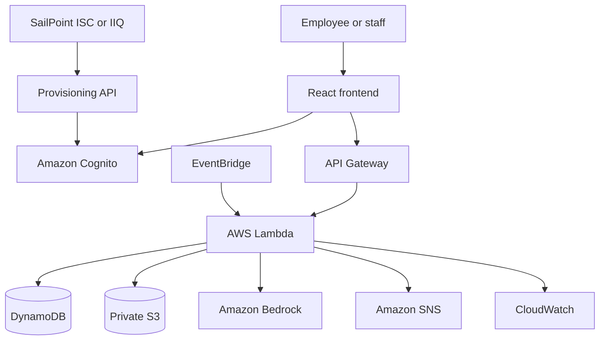

# Architecture

## Week 1 request flow

1. React redirects unauthenticated users to the Cognito authentication experience.
2. Cognito issues an ID token containing identity and group claims.
3. React sends the token in the API `Authorization` header.
4. API Gateway validates the token through the Cognito authorizer.
5. Lambda checks the role and the user's relationship to the requested asset.
6. Lambda validates input and reads or writes DynamoDB.
7. CloudWatch receives operational logs without request bodies, tokens, or private asset data.

## Target architecture

## SailPoint extension

SailPoint is the governance control plane. Cognito remains the authentication and token service required by the application. A later machine-to-machine provisioning API will expose narrowly scoped operations for aggregation, account enable/disable, and group membership. Its Lambda execution role will be limited to the required Cognito administrative APIs.

